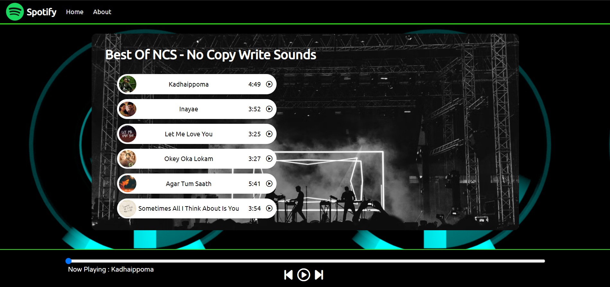

# SPOTIFY CLONE

## About / Synopsis

- This is a spotify clone with limited number of songs
- Project status: working/prototype

## Table of contents

<!-- Use for instance <https://github.com/ekalinin/github-markdown-toc>: -->

> - [Title / Repository Name](#spotify-clone)
>   - [About / Synopsis](#about--synopsis)
>   - [Table of contents](#table-of-contents)
>   - [Installation](#installation)
>   - [Usage](#usage)
>     - [Screenshots](#screenshots)
>     - [Features](#features)
>   - [Code](#code)
>     - [Content](#content)
>     - [Requirements](#requirements)
>     - [Limitations](#limitations)
>     - [Build](#build)
>     - [Deploy (how to install build product)](#deploy-how-to-install-build-product)
>   - [Resources (Documentation and other links)](#resources-documentation-and-other-links)
>   - [Contributing / Reporting issues](#contributing--reporting-issues)
>   - [License](#license)

## Installation

- Clone the repos - https://github.com/bibinthomas123/Spotify.git

## Usage

- To begin Run the index.html file and make sure all the required file path is mentioned in the program is relative to your local computer

### Screenshots

### Features

- Play/pause
- previous
- next
- seek bar
- relative cover img
- relative song name

### Content

Description : A spotify Clone made woth limited number of songs , we have a progress bar : Which contains seek-bar pause/play and previous and next buttons

### Requirements

Requirements : `*` A updated Browser is all it needs

### Limitations

- NULL

<!-- ## Resources (Documentation and other links) -->

## Contributing / Reporting issues

Link to JIRA component (or project if there is no component for that project). Samples:

- [Link to component](https://jira.nuxeo.com/issues/?jql=project%20%3D%20NXP%20AND%20component%20%3D%20Elasticsearch%20AND%20Status%20!%3D%20%22Resolved%22%20ORDER%20BY%20updated%20DESC%2C%20priority%20DESC%2C%20created%20ASC)
- [Link to project](https://jira.nuxeo.com/secure/CreateIssue!default.jspa?project=NXP)

## License

[Apache License, Version 2.0](http://www.apache.org/licenses/LICENSE-2.0.html)

## About ME 

I'm a student trying to learn new things by experiments ,i provide all my codes as an open source Content  written in HTML ,css, js . 

The source code, documentation, roadmap, issue tracker, testing, benchmarks are all public.

More information is available at [More about me ](https://github.com/bibinthomas123/Aboutme).
